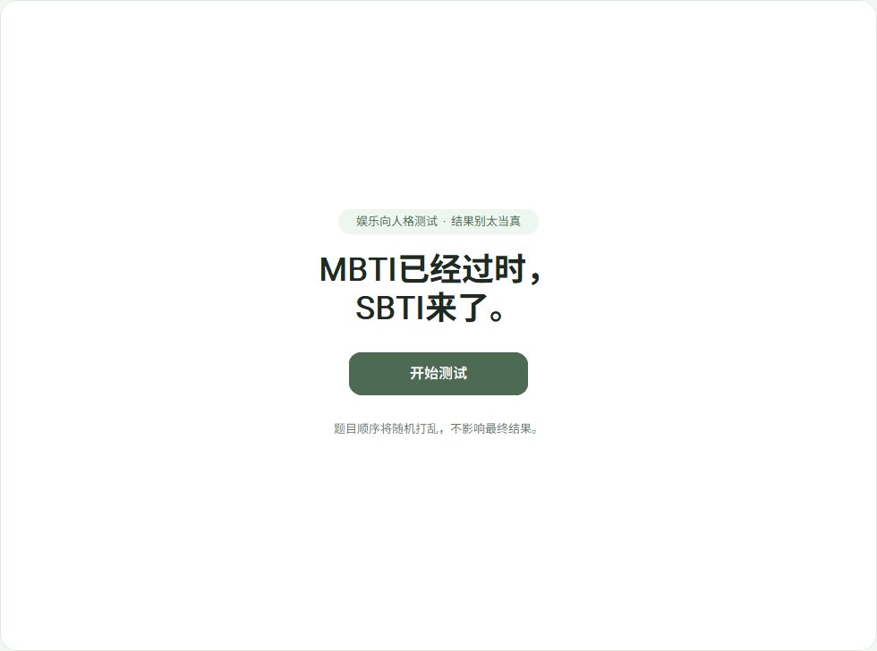

# SBTI 人格测试（桌面版）

测完你可能更懂自己，也可能更想关掉电脑——总之按钮在你手上。

---



## 用法一：伸手党模式（推荐）

1. 下载 `SBTI.zip`（整包，别只偷走一个 exe）。
2. 解压到任意文件夹。
3. 双击 `**SBTI.exe**`。
4. 若 Windows 跳出来拦你，多半是默认提示；信得过就「仍要运行」，信不过就……信朋友别信我。

> 解压后请保持 `**SBTI.exe` 和 `_internal` 文件夹** 待在同一个目录里，拆散了就跑不动，像没装电池的遥控器。

---

## 用法二：极客养成模式（从源码跑）

适合手里已经有 Python、并且乐于在黑色窗口里动手的同学。

1. 把本仓库或源码 **整个文件夹** 弄到本机（自带 `image/` 配图目录那种）。
2. 打开终端，**进入该文件夹**。
3. 装依赖：
  ```bash
   pip install -r requirements.txt
  ```
4. 运行 GUI：
  ```bash
   python sbti_gui.py
  ```

若提示缺模块，多半是忘了第 3 步；若窗口闪退，把报错复制下来搜一搜，人类友军一般都有答案。

---

## 你还需要知道什么？

- **配图**：`image/` 里该有题型对应图片；exe 包已经打进去的不需要你操心。
- **系统**：本程序是桌面小工具，不联网答题，数据不出你电脑（除非你自己发了截图）。

祝测得开心；若结果让你皱眉，那是量表在说话，不是命定论。